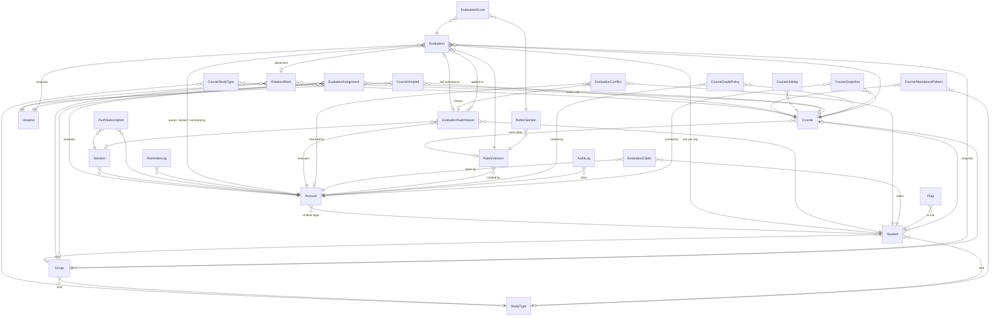

# Eva: Database Design (target)

> **Visual, interactive version:** https://claude.ai/artifact/CS3HFH23NKoKt58aFkJTP8 (private to the owner). Click a table there to see its columns, keys and connections.
> **Status:** target design, not migrated yet. It combines the v3 schema (`prisma/schema.prisma`) with the plans in `COURSE_SETUP_PLAN.md` (Goal 1), `EVALUATOR_APP_PLAN.md` (Goal 2) and `GRADING_CENTER_PLAN.md` (Goal 3).
> **Refinement introduced here:** the "rubric snapshot per course" from Goals 1–2 is modeled as its own table, `RubricVersion`. A published course points at one version, and each `RubricSection` belongs to a version.

## Size

28 tables, 52 relationships. 13 tables exist in v3, and 7 of those gain columns. 15 tables are new: 5 from Goal 1, 6 from Goal 2 and 4 from Goal 3.

## Areas

| Area | Tables |
|---|---|
| **Course & schedule** (the matrix) | Course, StudyType (= shift M/E), CourseStudyType, Hospital, CourseHospital, Group, Student, CourseAttendancePattern, CourseHoliday, RotationBlock |
| **People & access** | Account, Session, EvaluatorAssignment, PushSubscription, ReminderLog |
| **Evaluation engine** | **Evaluation**, EvaluationScore, EvaluationSubmission (append-only journal), EvaluationConflict, EvaluationClaim, Flag |
| **Rubric & grade policy** | RubricVersion, RubricSection, CourseGradePolicy |
| **Safety & audit** | AuditLog, CourseSnapshot, IntegrityRun, BackupRun |

## Relationships

`IntegrityRun` and `BackupRun` stand alone (they have no foreign keys).

## Key rules enforced by the database

| Rule | How |
|---|---|
| One grade per student per day | `UNIQUE (studentId, dateISO)` on Evaluation |
| A retried save counts once | `UNIQUE clientSubmissionId` on EvaluationSubmission |
| The journal can't be rewritten | A trigger rejects UPDATE/DELETE on `evaluation_submissions` |
| The app can't delete grades | The app role has no DELETE on evaluations, scores or submissions |
| Exact numbers | `NUMERIC(5,2)` for scores, maxima and totals; `CHECK score >= 0` |
| Valid values | CHECK constraints on attendance and on every status column |
| Ordered changes | Sequence `evaluation_change_seq` → `Evaluation.changeSeq` |
| Nightly proof | IntegrityRun (totals = sum of scores, no orphans) + BackupRun (pg_dump → R2) |

**Enums:** Role (ADMIN · EVALUATOR · STUDENT) · Shift (MORNING · EVENING) · CourseStatus (DRAFT · PUBLISHED · ARCHIVED) · EvaluationStatus (ACTIVE · DISPUTED)
