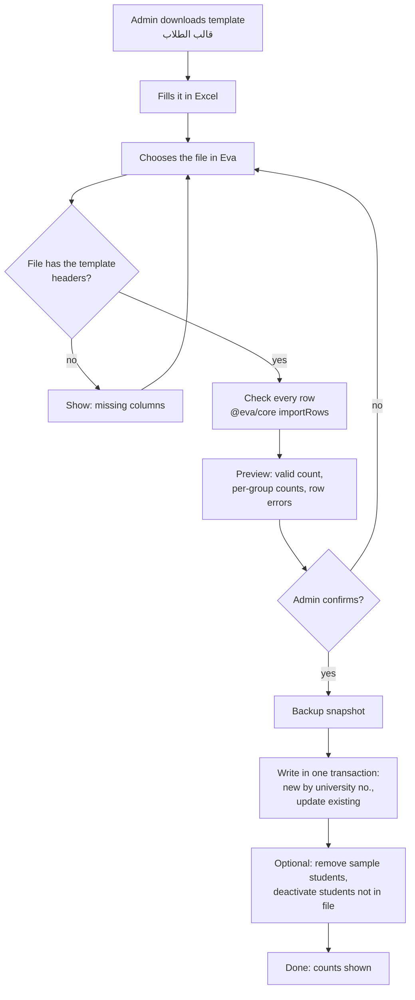
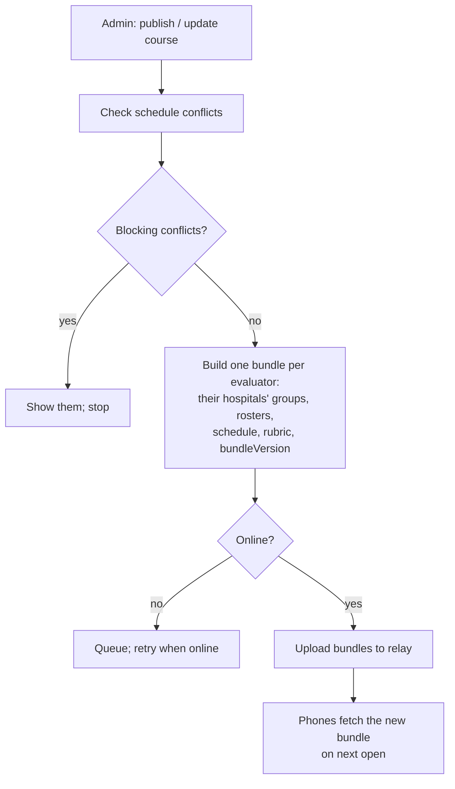
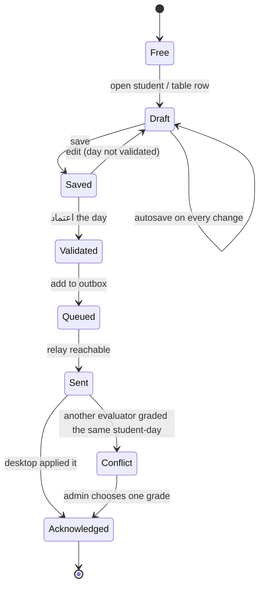
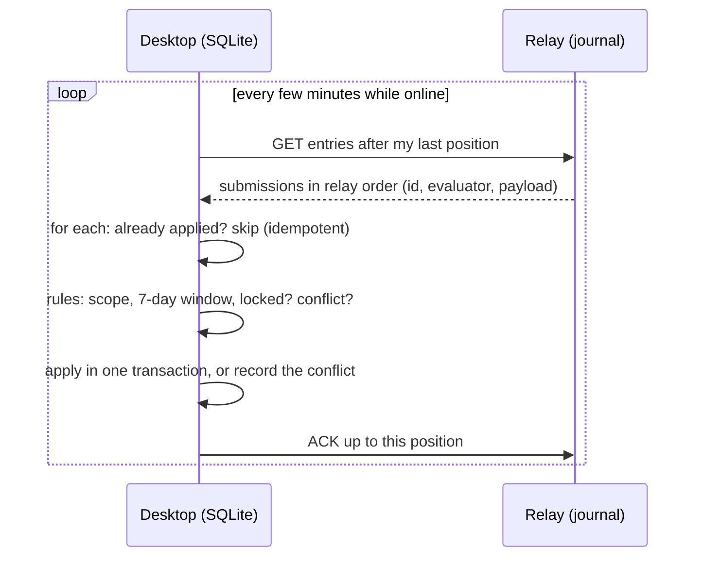
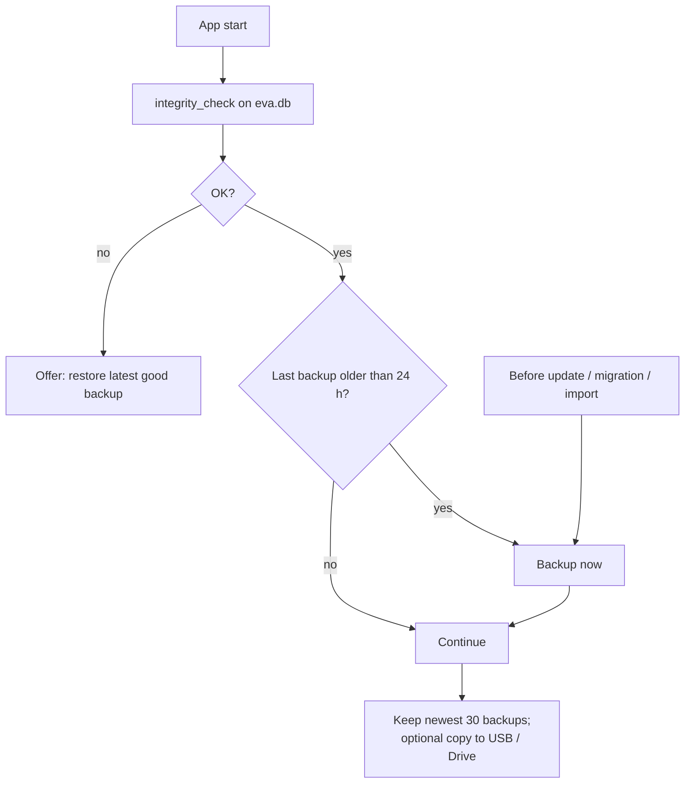

# Eva: key flows

Diagrams for `docs/DESKTOP_APP_PLAN.md` §6. They render on GitHub (Mermaid).
"Desktop" is the admin's Eva Desktop app, "relay" the sync mailbox, and
"phone" the evaluator app.

## 1. Import students from Excel

## 2. Publish the course to evaluators

## 3. Evaluator grading on the phone

## 4. Desktop pulls grades

## 5. Backup and restore

