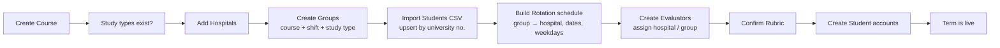
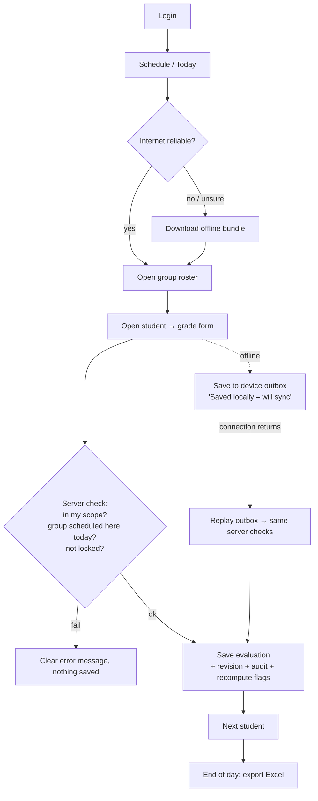
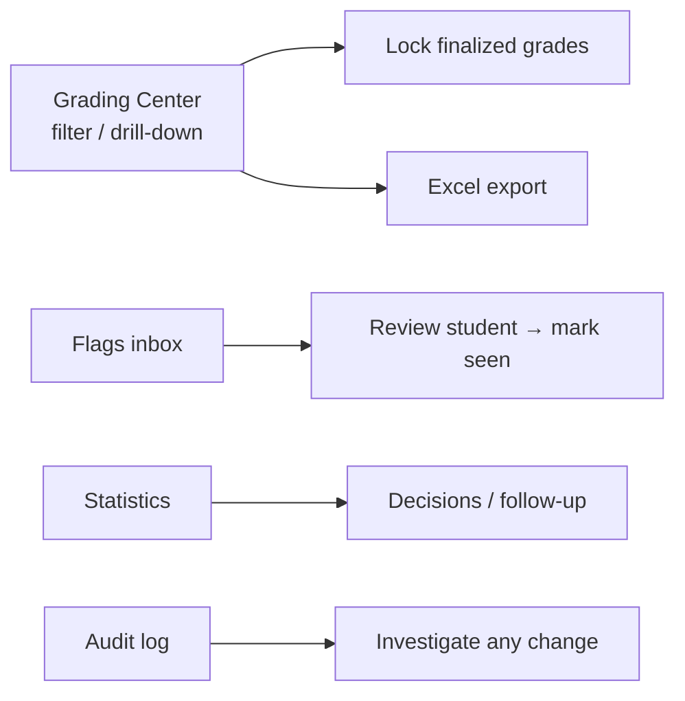

# Eva — Clinical Evaluation System · Phase 1: Planning

> **Status:** DRAFT, waiting for approval
> **Date:** 2026-09-27
> **Scope:** A clean rebuild ("Eva v4"). This document covers goals, users, functions, sections and workflow. Phases 2–4 (UI, data engine, deployment) are listed at the end so the whole roadmap is in one place.
> **Source:** Analysis of the current Eva v3 codebase (`prisma/schema.prisma`, `src/lib/models/*`, `src/lib/actions/*`, `README.md`, `PROJECT_GOALS.md`). What v3 already does is carried forward. What v3 got wrong is listed in §9 so the rebuild avoids it.

---

## 1. What the software is

Eva is a web app (Arabic, right-to-left, installable on phones) for a nursing college's **clinical training evaluation**. Students are split into **groups**. Each group rotates through **hospitals** on fixed weekdays, following a schedule. At each hospital, an assigned **evaluator** (a clinical instructor) records each student's **attendance and daily scores** against a **rubric**. The college **admin** sees every grade in one place, gets warnings about at-risk students, and exports reports. **Students** see only their own grades.

**The main promise: a grade that has been entered is never lost, never overwritten without a trace, and never shows up under the wrong student.**

## 2. Project goals

| # | Goal | How we will know it is met |
|---|------|------------------------|
| G1 | **Zero grade loss** | Every save is stored permanently, including saves made offline. Every change keeps the previous value (full history). Backups exist outside the hosting provider. |
| G2 | **Correct identity** | The student's identity is the **university number**, never the name. Imports never create a duplicate "ghost" student. |
| G3 | **Right person, right scope** | An evaluator can see and grade only their assigned hospital/group, on days their group is scheduled there. A student can see only their own record. All of this is checked on the server. |
| G4 | **Works in the hospital** | An evaluator can load the day's roster once and then grade with no internet. Grades sync automatically when the connection returns. |
| G5 | **Admin has full visibility** | One Grading Center shows every evaluation, with filters, totals, and Excel export, plus statistics and at-risk flags. |
| G6 | **Configurable without code** | The rubric, courses, study types, hospitals, groups and rotation schedule are all data an admin can edit. None of them are hardcoded. |
| G7 | **Accountable** | Every create, update, deactivate and grade change is recorded in an audit log: who, when, before and after. |

## 3. Users and roles

| Role | Who | Can do | Cannot do |
|------|-----|--------|-----------|
| **Admin** | College staff / coordinators | Everything: set up the registry, schedule, evaluators, rubric; view and export all grades; lock grades; review flags; see the audit log | — |
| **Evaluator** | Clinical instructor at a hospital | See their schedule; open a group's roster; record attendance and scores; work offline; export their day to Excel | See other hospitals or groups; grade outside the schedule; edit locked grades; open admin pages |
| **Student** | Enrolled nursing student | See their own evaluation history, scores, feedback and flags | See any other student; change anything |

Accounts are **created by the admin only**. There is no self-registration. Login is by email and password, or by Google Sign-In linked to an existing account (Google never creates a new account).

## 4. Core concepts (domain model)

```
Course (year + number, e.g. 2026 / 1st course)
 └─ Group (name, shift: morning/evening, study type)
     ├─ Students (identity = university number; auto code e.g. 26-1-N-0001)
     └─ Rotation blocks: "Group X is at Hospital Y from date A to date B, on SUN,TUE"

Hospital ── Evaluator assignments (evaluator → hospital, optionally → one group)

Rubric sections (label, max score, order)   e.g. 5 + 7 + 1 + 1 + 1 = 15

Evaluation = ONE row per (student, date)
   attendance (present / late / absent), score per rubric section, total,
   notes, feedback, evaluator, hospital, group, locked?
   └─ Revision history (every change kept)   ← new in the rebuild

Flag = at-risk warning per (student, rule)
Audit log = every change to every record
```

**Default rubric (carried over from v3):** Daily Note 5 · Discussion & Feedback 7 · Attitude & Communication 1 · Punctuality 1 · Appearance 1 = **15**.

**Student code format:** `YY-Course-StudyTypeCode-Sequence`, for example `26-1-N-0001`. It is used for display and quick lookup. The university number remains the official key.

## 5. Sections of the software (modules)

### A. Admin area
| Section | Purpose |
|---------|---------|
| **Dashboard** | Counts, today's activity, number of unread flags, quick links |
| **Setup / Master sheet** | One combined view of courses, study types, hospitals, groups and the rotation timeline (Gantt) |
| **Courses** | Year and course intakes (e.g. 2026-1, 2026-2), active or archived |
| **Study types** | For example Nursing (code `N`), with Arabic and English names |
| **Hospitals** | Training sites |
| **Groups** | Group name, course, shift, study type |
| **Rotation schedule** | Date ranges and weekdays each group spends at each hospital |
| **Students** | Add, edit, deactivate; **CSV/Excel bulk import** (upsert by university number); export |
| **Evaluators** | Create evaluator accounts; assign hospital (+ optional group); activate/deactivate |
| **Student accounts** | Create logins linked to registry students |
| **Rubric** | Add, edit, reorder, deactivate sections. Sections are never deleted, so old grades keep their labels |
| **Grading Center** | Every evaluation, with filters (course, study type, hospital, group, evaluator, student, date range), a per-student drill-down, a tree view, lock/unlock, and Excel export |
| **Statistics** | Averages, pass rates and attendance by hospital, group, course and evaluator |
| **Flags** | At-risk students: low scores, absences, declining trend. Mark as reviewed |
| **Audit log** | Searchable history of every change |

### B. Evaluator app (mobile first, works offline)
| Section | Purpose |
|---------|---------|
| **Today / My students** | Students scheduled with me today, with graded or not-graded status |
| **Schedule** | My rotation stints (past, current, upcoming) → open a group roster |
| **Grade student** | Attendance + a score per rubric section + notes + feedback. Opening the same student on the same day edits that day's entry |
| **Offline import** | "Download my schedule for offline work": roster, rubric and existing grades |
| **Sync status** | Pending, synced or failed count, with a "Sync now" button |
| **Export day** | Excel file of the day's evaluations, per criterion |

### C. Student portal
| Section | Purpose |
|---------|---------|
| **My record** | Evaluation history, per-section scores, totals, attendance, feedback, active flags |

### D. System (runs in the background)
Authentication and roles · scope enforcement · flag engine · audit logger · offline outbox and sync · backups · exports.

## 6. Workflows

### 6.1 Term setup (admin, once per course)


### 6.2 Daily evaluation (evaluator)


### 6.3 Oversight (admin)


### 6.4 Student
Login → My record → view scores, feedback and flags. Read only.

## 7. Business rules (must hold everywhere)

1. **One evaluation per student per day.** A second save on the same day updates that entry, and the old value goes into the revision history.
2. An evaluator can grade a student **only if** (a) the student's group is inside the evaluator's assignment scope, **and** (b) the rotation schedule places that group at the evaluator's hospital on that date. The server checks this on every save, including offline replays.
3. **Locked** evaluations can be changed only by an admin. Every unlock is audited.
4. Scores are clamped to `0 … maxScore` for each section. The total is always computed on the server and never trusted from the client.
5. **Flags** are recomputed after every save:
   - `low_score` (warning): 2 or more evaluations below 60% of the rubric maximum
   - `attendance` (danger): 2 or more absences
   - `declining_trend` (warning): the least-squares slope of the last 5 totals is ≤ −0.75 (needs at least 3 points)
   - A "reviewed" flag stays reviewed while the same condition continues.
6. Registry records are **deactivated, never hard-deleted**, so history stays intact.
7. Imports match on **university number**. An existing number updates the record and a new number creates one. Matching is never done by name.
8. Backdating (grading a past date) is **admin-only** or needs a controlled override. *(Decision needed, see §10.)*

## 8. Non-functional requirements

- **Language:** Arabic UI, RTL; English secondary labels where useful.
- **Devices:** phone first for evaluators; desktop for admin.
- **Offline:** full offline grading for hours; installable PWA.
- **Security:** hashed passwords, httpOnly session cookie, server-side role and scope checks, no secrets in the repo.
- **Scale (estimate):** hundreds to low thousands of students per course, tens of evaluators, about 15 hospitals. Every list is paginated.
- **Performance:** grading a student takes less than 1 s online and is instant offline.
- **Durability:** point-in-time recovery plus daily off-platform backups with 30+ days of retention, and a tested restore procedure.

## 9. Lessons from v3 the rebuild must fix

| v3 issue | Rebuild answer |
|----------|----------------|
| Grade edits **overwrite** the previous value (last-write-wins, no history) | `EvaluationRevision` table: append-only history of every change |
| Offline replay can double-submit on flaky networks | Client-generated **idempotency key** for each outbox entry. The server ignores duplicates |
| Clearing a flag deletes its row, so "reviewed" state and history are lost | Flags get a status (`active` / `resolved`) instead of being deleted |
| Neon free tier: **6-hour PITR only**; daily snapshot routine failed (`snapshots limit exceeded`) | Scheduled `pg_dump` to separate storage (e.g. Cloudflare R2), plus a documented restore drill |
| Deploy target moved three times (Netlify → second Netlify site → Cloudflare Workers) with no docs; Prisma had runtime issues on Workers | Pick **one** deploy target in Phase 4, before writing more code for it, and record it in memory |
| No automated tests in CI; smoke scripts not repeatable | Automated test suite in CI from Phase 3, starting with the data engine |
| Admin password comes only from seed; no change/reset password | Change-password screen and forced change on first login |
| Rubric sections could not be edited in the UI | Full edit UI (label, max score, order) |
| Memory file grew into 2,000+ lines of repeated log entries | Short structured memory (`docs/MEMORY.md`) plus a decisions log; no repeated status entries |

## 10. Open decisions (please answer before approval)

1. **Rebuild location:** start fresh in this repo (archive v3 to a branch or tag) or in a new repo? *Proposed: same repo, tag `v3-final`, new code on `main`.*
2. **Stack:** keep Next.js + TypeScript + Postgres (Neon) + Prisma? *Proposed: keep. The team knows it and it fits the problem.*
3. **Final course grade:** is there a formula that turns daily evaluations into a final clinical mark (for example average of daily totals scaled to X, attendance penalty)? v3 has no final-grade calculation. **Please describe it if one exists.**
4. **Pass mark:** is 60% right for "low score" and pass rate?
5. **Backdating:** can evaluators grade a missed past day? If yes, within how many days?
6. **Evaluator edits:** can an evaluator edit their own grade after the day ends, or only until the admin locks it?
7. **Multiple evaluators:** can two evaluators grade the same student on the same day? v3 allows only one evaluation per student per day.
8. **Keep Google Sign-In?**
9. **Existing data:** migrate v3's production data into the new system, or start clean?

## 11. Roadmap overview

| Phase | Content | Output |
|-------|---------|--------|
| **1. Planning** *(this doc)* | Goals, roles, sections, workflows, rules | Approved plan + memory hub |
| **2. UI design (simple)** | Wireframe-level screens for the three areas, RTL, mobile-first evaluator flow | Clickable basic UI, no real data |
| **3. Database + data engine** *(most important)* | Schema, migrations, grade-save transaction, revisions, idempotent sync, scope and schedule enforcement, flag engine, audit, imports/exports, backups, automated tests | Tested engine that never loses a grade |
| **4. Deployment** | Single chosen host, environment/secrets, migrations in the pipeline, backups, monitoring, restore drill | Live production + runbook |
